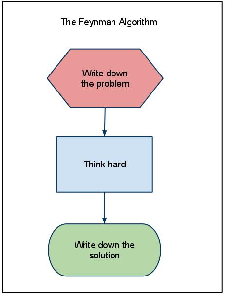

# [ARCHIVED] ProtoSchool Chengdu

*******************************

### THIS REPO IS NO LONGER IN USE AND HAS BEEN ARCHIVED.

This repo has been archived as part of the transition to ProtoSchool's new local event leadership model, [announced](https://github.com/ProtoSchool/organizing/issues/84) in March of 2020. If this group is still hosting ProtoSchool workshops, they'll be listed on our events page.

**Please visit our [events page](https://proto.school/#/events) to find upcoming workshops near you** and learn more about the groups hosting them. 

**Learn more about [hosting events](https://proto.school/#/host)** under our new model, which makes it easier than ever for newcomers to start hosting ProtoSchool workshops based on our interactive [tutorials](https://proto.school/#/tutorials).

*********************************

Welcome to the Chengdu chapter of [ProtoSchool](https://proto.school)!

We are a group of people passionate about the decentralized web and excited to learn, teach, and share ideas. Everyone is welcome!

We focus on building the ecosystem around [IPFS](https://ipfs.io/) (a decentralized networking protocol), and [Filecoin](https://filecoin.io/) (a cryptocurrency-powered decentralized storage network), both open source projects sponsored by [Protocol Labs](https://protocol.ai/).

Everyone is welcome to join us to learn, to promote, to research, to develop, and to share ideas of the amazing tech together!   
:raised_hands:

## Preliminaries

Everyone should read Code of Conduct below firstly ！

Everyone should follow this [Chapter Chengdu Slides Template](./meetup/chapterchengdu_template.pptx)

This repo support two language :     

## Meetup

 “If you can't explain it simply, you don't understand it well enough.” - Albert Einstein.

* [Tech Meetup & Chapter Chengdu Kickoff - Recall](./meetup/07212019/活动回顾--『协议学院%20·%20成都分院%20·%20开院典礼』.md)
* Chapter Chengdu Meetup - next session - coming soon

 
## Research
We follow the research philosophy of [the Feynman algorithm](http://wiki.c2.com/?FeynmanAlgorithm) to solve hard problem. 

  

## Organizers

Our chapter's leadership team includes:
* Taosheng Shi ([@taoshengshi](https://github.com/taoshengshi))   
   [taoshengshi01@gmail.com](taoshengshi01@gmail.com), [twitter.com/taoshengshi](twitter.com/taoshengshi)
   

## Code of Conduct

In the interest of fostering an open and welcoming environment, we as
contributors and maintainers pledge to making participation in our project and
our community a harassment-free experience for everyone.

By participating in this project (online and at live chapter events) you agree to abide by its [Code of Conduct](./CODE_OF_CONDUCT.md).

## License

ProtoSchool is licensed under the Apache-2.0 and MIT licenses. See [LICENSE.md](https://github.com/protoschool/seattle/blob/master/LICENSE.md) for further detail.
