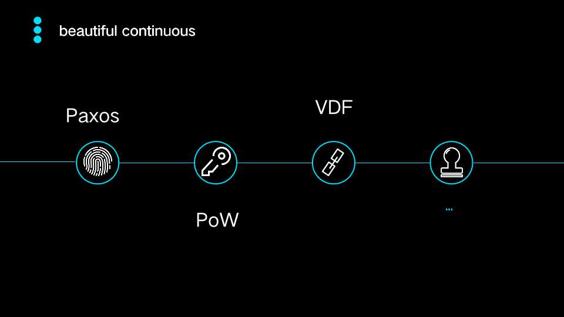

2019.7.21日成都高新区，由协议学院（ProtoSchool）成都分院主办，IPFS原力区承办的「协议学院成都 · 开院典礼」与众多技术大咖齐聚高新区菁蓉国际广场6栋A1。协议学院是一个非营利的学习社区，面向开发者和技术人员，协议学院 · 成都举办活动的目的旨为分享和传授DWeb相关的数据结构、协议、算法以及工具等知识。

开院典礼（即技术沙龙第一期）现场，嘉宾从【IPFS Camp 亮点分享】、【区块链分布式存储在医保行业的应用】、以及【Paxos、PoW、VDF：美丽的黄金线】等主题进行分享与交流探讨。

  

当天活动由分布式系统研究员石涛声与IPFS原力区COO Adeline Sun共同主持，石涛声即协议学院成都分院组织者。他（她）们对远道而来的嘉宾及参会者表示欢迎，并简要介绍了承办方“IPFS原力区”，原力区创始人龙王-张成龙也亲临现场表示祝贺，随后开园典礼仪式及致辞在一片和谐中顺利推进，进入了参会者自我介绍环节。

本次活动分享嘉宾分别为来自IPFS原力区的李昕（协议学院上海分院组织者）和孙慧娟、来自成都影达科技的姜疆，及组织者石涛声，以下为活动内容回顾。  

# Part I

 

首先来自IPFS原力区的李昕此次带来的是《IPFS Camp 亮点分享》，主要分享6月底7月初IPFS官方在巴塞罗那举办的技术极客夏令营过程中碰撞出的新兴想法、活动趣事及大量技术分享活动中的高光时刻。  

  

  

李昕提到，这60小时排期满满，无论是技术干货还是闪电演讲，无论是团队合作还是良性比赛，每时每刻精神紧绷又兴奋。   

  

整个活动全权由IPFS团队运作，没有商业运作和投资分析，工作人员不多但机动性超强并充满活力。160个参会人员共同经历了核心课程、选修课程、闪电演讲、海报项目等等。

  

  

  

最后，在自由话题讨论中，活动临近尾声，李昕表示官方“颁发”的这个“成绩证书”十分有意义，我们在做的事情更是充满价值、自由。

  

# Part II
   
来自成都影达科技CEO姜疆，他分享《区块链分布式存储在医保行业的应用》，从医保行业的具体场景出发，分析分布式存储的价值趋势。   

   
首先，姜疆分享了他对于分布式存储在分布式商业架构里的定位，将存储业务置身于大行业服务的一环，用医疗相关数据分析当前潜在风险与未来潜在价值。

 

姜疆抛出了一个长久存在的问题：如何在平衡隐私、安全、成本的前提下，促进该系统的良性运转！
在这里，姜疆提到了借鉴传统产品HumanAPI做区块链版本的健康数据服务。

 

最后姜疆详细分享了他的一个基于区块链技术实现的医保相关项目商业闭环架构的思路与进展，再一次强调了存储安全与私密的重要性。

# Part III

 

组织者石涛声作为第三位分享嘉宾，带来关于《Paxos、PoW、VDF：一条美丽的黄金线》在区块链的技术体系链条上的相关解读。  

   

   

石涛声从Paxos三十年的拜占庭容错历史研究与机制，引出区块链恶意、诚意、理性节点的嫁接运用；从Pow十年的拜占庭共识，聊到Nakamoto的比特币及Pow的影响。  

    

  

接下来是技术“黄金线”的VDF部分，石涛声聊到关于VDF领域近年的文献贡献、区块链对VDF的兴趣及VDF项目管理平台，更聊到了VDF的本质、VDF解决及待解决的问题、VDF对Filecoin网络的深刻影响。   
  

  

  

    

   

最后，石涛声梳理了这个技术黄金线的默契亮点，对未来的技术栈和未可知充满期许。

会后，参会者就Filecoin 和 IPFS 等技术问题进行了深入交流。

以上即为协议学院成都分院成立典礼即第一期技术沙龙回顾，活动宗旨在于通过线下聚会及分享，在Dweb、分布式等领域共享近期各位大咖的观点与见解，互相学习，共同进步。